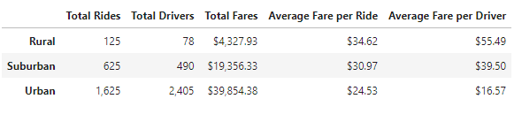

# Ride-sharing Data by City Type Analysis

## ***Overview of the school district analysis***

### **Purpose**
<!--Explain the purpose of the new analysis..-->
<!--The purpose of the new analysis is well defined. (3 pt)-->

Deliver a report with the collected information that abstracts how the data differs by city type and how those differences can be used. As well it is also important to mention that the extract of the given analysis will provide the necessary tools to V. Isualize and the decision-makers in PyBer in order to determinate the next steps to take the company on a better path.

 

## ***Results***
<!--Using images from the summary DataFrame and multiple-line chart, describe the differences in ride-sharing data among the different city types..-->
<!--There is a description of the differences in ride-sharing data among the different city types. Ride-sharing data include the total rides, total drivers, total fares, average fare per ride and driver, and total fare by city type. (7 pt)-->

### **Differences in ride-sharing data among the different city types**

<table>
    <tr>
        <td>Pyber Summary</td>
    </tr>
    <tr>
        <td></td>
    </tr>
</table>

When we look at this Dataframe we can get some insights that could be quite obvious but we will explain them in the next statetments.

- Comparisson of Totals vs. City Types
  - We mention the three totals as one (Total Rides, Total Drivers, and Total Fares), because they have the same tendency of being directly proportional to the city type. Meaning that as the city type being catalogued depending of their population density, radio, location, etc., the Totals are being reflected by the city type "size".
  - City Type Size Reflection:
    - **Rural** | we are classifying it as a "small city", and it is being reflected at the result numbers of the Dataframe with less Rides and Drivers per each totals, and the smallest amount in the total of Fares. Taking in mind the 3 totals and the 3 data 'category', the general average percent of this city type is only a 5%.
    - **Suburban** | we are classifying it as a "medium city", and as well it is being reflected at the result's numbers of the Dataframe and being positionated between the Rural and Urban city types at the Total Rides, Total Drivers, and Total Fares. Taking in mind the 3 totals and the 3 data 'category', the general average percent of this city type is a 24%.
    - **Urban** | we are classifying it as a "big city", and this final city type also reflects their proportion at their results in the Dataframe with the biggest amounts of the three city types. Taking in mind the 3 totals and the 3 data 'category', the general average percent of this city type is a 71%.

- Comparisson of Averages vs. City Types
  - Taking the same dynamic as previous point, we are mentioning the two averages as one (Average Fare per Ride and Average Fare per Driver), because as well there's a tendency that is inversely proportional to Total's numbers, but quite understandable to the reflected city type.
  - City Type Size Reflection:
    - **Rural** | in this case as being a small city, it won't affect the averages by decreasing them and being the smallest amount at the Dataframe. In this case is quite the opposite because as the rural area probably have more demand than offer, this could be reflected on the prices (need to pay more for the service). Meaning less Drivers/Rides but with a higher Fare. Taking in mind the 2 averages and 3 data 'category', the general average percent of this city type with a majority percentage is 44%.
    - **Suburban** | as being classified as a medium city, this still remains in the "second" place between the Rural and Urban city type, but instead is being considered in descending position (as we can recall in the past comparisson it was ascending, and it was like this: Rural - 5%, Suburban - 24%, and Urban - 71%; in this case Rural has the most percentage and then Surburban). Meaning that in this city the relation offer-demand could variate and might be "balanced" between the Drivers/Rides vs. Fares. Taking in mind the 2 averages and 3 data 'category', the general average percent of this city type with a majority percentage is 35%.
    - **Urban** | as being the biggest city type of the three types, this one will have a similar behaviour as the Rural type, but in an opposite way. In this the urban area probably have more offer than demand, and this could be reflected on the prices (need to pay less for the service). Meaning more Drivers/Rides but with a smaller Fare. Taking in mind the 2 averages and 3 data 'category', the general average percent of this city type with a majority percentage is 21%.

### **Behaviour of fares-city types in the first trimester**

<table>
    <tr>
        <td>Pyber Fare Summary</td>
    </tr>
    <tr>
        <td></td>
    </tr>
</table>

As we can notice at the line chart, the shown results could be as expected, but here's some insights:
- Taking into account that although the Rural city type has a higher price in terms of Fare per Ride, the amount of services in the Urban area higher. So in this case, the sum of the Total Fares for the whole trimester of the Urban area is almost 950% more than the Rural area.
- As well the Suburban has the same tendency as above comparissons, where it reamins between the Rural and Urban city types.
- As a final conclusion for this chart, as we can see there're some peaks and valleys per linear representation but at none of those points does one line exceed the other.

 

## ***Summary***
<!--Based on the results, provide three business recommendations to the CEO for addressing any disparities among the city types.-->
<!--There is a statement summarizing three business recommendations to the CEO for addressing any disparities among the city types. (4 pt)-->

As a general comment of the analysis, we can infer much of the results by taking in mind the general knowledge of how the city types are stablished, but as all analysis there should be a support of what are we exposing. This is why the above results of the relation of the City Types versus the different data are important to be shown in a clear and visual format.

Nevertheless the company stands in good position, 'healthy' and with good numbers, we can give some recommendations based on the insights we got.
- For the Rural areas the incentive should be quite aggresive, as being a "small" area to perfom there are some limitations. It could be an incentive to the user where per certain number of rides, you could receive a bonification (ex., if you have 10 rides in this month you get a free ride, or a good discount in the next ride, or a joint venture benefit with business partner company, etc.).
- For the Suburban areas, this city type is quite a good potential market because of the possibility of growth. Normally, this kind of areas are really close to the Urban, so as an option it could be to give an incentive to the Urban Driver's where if they manage to do certain numbers of rides at the Suburban Area, they can get a bonus. But this bonus should be capped per month, so that the Urban area is not neglected.
- For the Urban areas, we can infer that there should be parts of the city where the demand is really high, so in that places in specific times of the day it can apply an dynamic fare where the fare fluctuate depending on the demand. Also with a capped percentage raise, in order that the fare doesn't raise a lot.